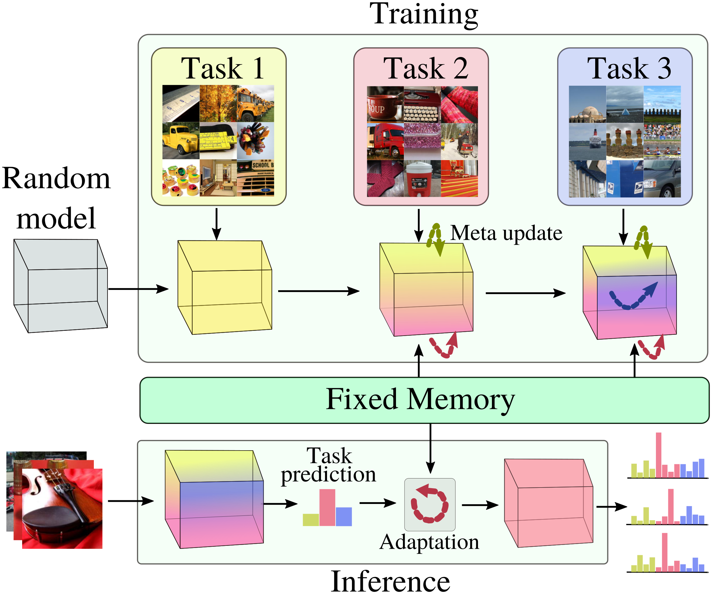

# iTAML : An Incremental Task-Agnostic Meta-learning Approach
Official implementation of "iTAML : An Incremental Task-Agnostic Meta-learning Approach". (CVPR 2020) [(paper link)](http://papers.nips.cc/paper/9429-random-path-selection-for-continual-learning). 

iTAML : An Incremental Task-Agnostic Meta-learning Approach (accepted at Conference on Computer Vision and Pattern Recognition, Seattle, Washington, 2020), hypothesize that generalization is a key factor for continual learning. In this pursuit, we learn a set of generalized parameters, that are neither specific to old nor new tasks by introducing a novel meta-learning approach that seeks to maintain an equilibrium between all the encountered tasks. This is ensured by a task-agnostic meta-update rule which avoids catastrophic  forgetting. When presented with a continuum of data, our model automatically identifies the task and quickly adapts to it with  just a single update. 

This code provides an implementation for iTAML. This repository is implemented using pytorch and it includes code for running the incremental learning domain experiments on MNIST, SVHN, CIFAR100, ImageNet and MS-Celeb-10K.

<p align="center"></p>
<p align="center">(a) iTAML overall learning process</p>

### Dependencies
This code requires the following:
* matplotlib==3.2.1
* numpy==1.18.2
* pandas==1.0.3
* Pillow==7.0.0
* scipy==1.4.1
* torch==1.4.0
* torchvision==0.5.0

run `pip3 install -r requirements.txt` to install all the dependencies. 

### Data
All the dataloading is handled at `incremental_dataloader.py` and the experimental setting for the datasets are handled at `args` class in `train_<dataset>.py`. `args` class contains all the hyper-parameters settings to run the experiment. For example, consider the following:
   
 ``` 
class args:
    dataset = "cifar100"
    checkpoint = "results/cifar100/test1"
    savepoint = "models/" + "/".join(checkpoint.split("/")[1:])
    data_path = "../Datasets/CIFAR100/"
    
    num_class = 100
    class_per_task = 10
    num_task = 10

    memory = 2000
    beta = 1
    r = 1
    .
    .
```
Here, `dataset` can be set to the following:
- "cifar100"
- "cub200"
- "imagenet"
- "celeb"
- "mnist"
- "svhn"

`checkpoint` and `savepoint` saves the records of performance and trained models, respectively. `data_path` points to the location of the dataset downloaded, if it is not downloaded previously, the script will download and extract at the pointed location. As mentioned in our paper, each dataset can be run with different class incremental settings, hence the total number of classes included in the experiment, number of classess assigned per each task and the total number of tasks are defined at `num_class`,  `class_per_task`, and `num_task`. Also, `memory` is the upper bound for the number of exemplars. Further, `beta` is the decay-rate, which controlls the amount of fusion between old parameters and current parameters and `r` is the number of inner loop updates.
    
### Usage
To run the experiment, run `CUDA_VISIBLE_DEVICES=0 python3 train_cifar.py [x]`. Here `[x]` is a system argument of the starting task id. begins with `0`.

### Results


### Contact
To ask questions or report issues, please open an issue on the [issues tracker](https://github.com/brjathu/iTAML/issues).

